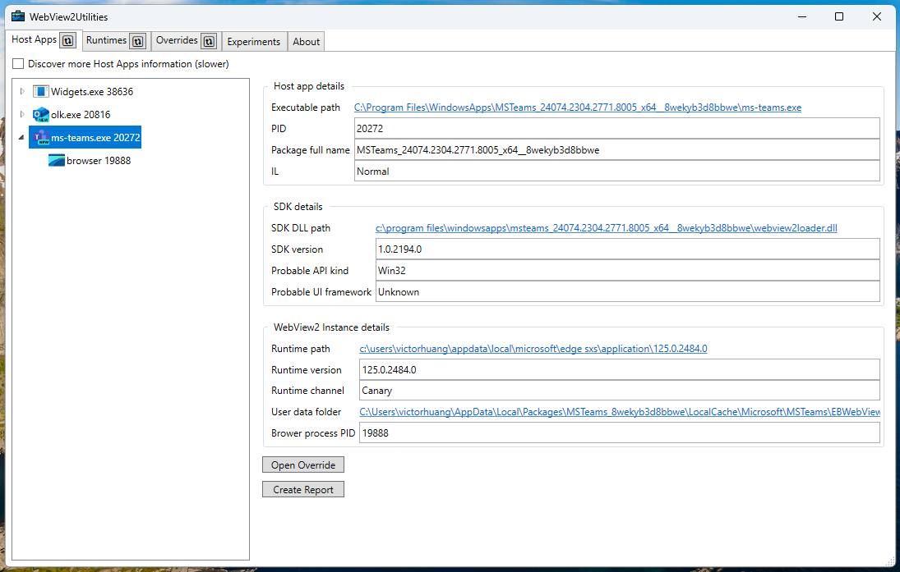

# WebView2Utilities
WebView2 Utilities help you develop and debug Microsoft Edge WebView2 apps.

## Install & Run

* Install via the [ClickOnce install page](https://david-risney.github.io/webview2-utils/install/wv2util.application).
* Or copy the binaries off the [releases page](https://github.com/david-risney/webview2-utils/releases/) to somewhere on your machine.
* Or build [the code](https://github.com/david-risney/webview2-utils) yourself.

## Override tab

This tab helps you set the [loader override policy registry keys](https://docs.microsoft.com/en-us/microsoft-edge/webview2/reference/win32/webview2-idl?view=webview2-1.0.774.44#createcorewebview2environmentwithoptions).

* `Host app exe` is the name of the host app's executable. Alternatively if you set this to `*` it applies to every host app that doesn't otherwise have a match.
* `Runtime path` is the path to a WebView2 Runtime or non-stable channel Microsoft Edge browser. The path should have the msedgewebview2.exe in it. If set the host app will use this runtime instead of whatever they requested.
* `User data path` is the path to a user data folder. If set the host app will use this user data folder instead of whatever they requested.
* `Browser arguments` is additional command line switches to be passed to the browser process created for the WebView2. If set, this is merged in with whatever the app sets. See the [list of chromium command line switches](https://peter.sh/experiments/chromium-command-line-switches/) to see what switches exist.
* `Reverse runtime search order` if set and the Runtime path isn't set and the host app is using an evergreen runtime, then instead of discovering installed runtimes from most stable to least stable channel, instead they will be picked from least stable to most stable channel.

## Runtimes tab
Press the refresh button in the Runtimes tab to populate the list of installed WebView2 Runtimes and Microsoft Edge browser installations. These are paths that you might use with the `Runtime path` field in the Overrides tab.

## Host Apps tab
Press the refresh button in the Host Apps tab to populate the list of running apps using WebView2. This will only show apps with active WebView2 instances running. If an app has more than one WebView2 browser process running multiple entries will be listed for that app. From here you can see information about which runtime the app is using, and user data folder.
